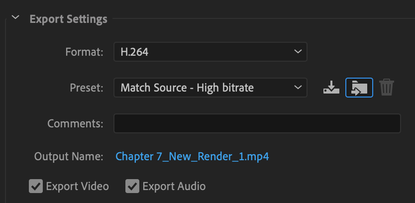
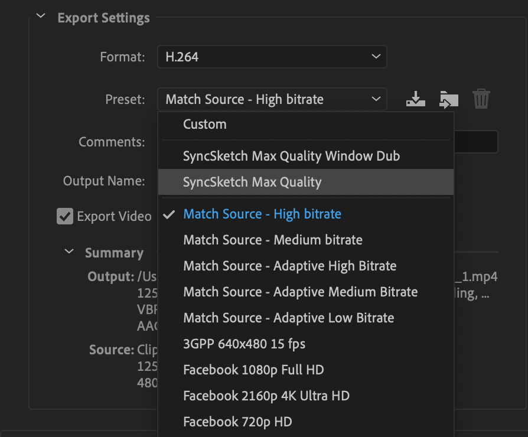

# SyncSketch Encoding Preset Pack for Adobe Creative Cloud Applications
This is a set of media encoding presets for the [Adobe Creative Cloud](https://www.adobe.com/creativecloud.html) applications such as Premiere Pro, After Effects, Audition and Media Encoder.  They are designed to encode your media for upload to the  [SyncSketch](https://www.syncsketch.com) collaborative video client review service.

Once installed, these can be used from within Premiere Pro, After Effects, Audition and Media Encoder.

## Installation
The simplest way to install these presets is to import them using the Import Preset button within the Export Settings windows in the Creative Cloud applications. The button is outlined in blue below:

However, you may prefer to install them by copying them directly into the Media Encoder's Presets folder.  This folder can be found within the Adobe folder in your Documents folder.  For example:

**Documents > Adobe > Adobe Media Encoder > 13.0 > Presets**

(the "13.0" in this example is the version number for Adobe Media Encoder CC 2019; your version number may vary.)

## Use

Once installed, these will appear at the top of the **Presets** menu when **H.264** is selected as the **Format**:

So, when exporting media from an After Effects comp or Premiere Pro sequence, Use the Media Encoder and set the **Format** to **H.264**, then choose a SyncSketch preset.

### SyncSketch Max Quality
This encodes your video as an approximately 4Mbits/sec, 2-pass VBR H.264 1280x720 square-pixel movie with a keyframe interval of 10 frames.  (The frame rate will be whatever your source's frame rate is.) Audio encoding is AAC 128kbits/sec. This is a close approximation of the format that is used by SyncSketch's transcoding stage at ingest.

(Indeed, if you are using the SyncSketch API, using the `noconvert` flag will bypass that transcode, making your review ready that much sooner.)

### SyncSketch Max Quality Window Dub

This adds a timecode overlay burned into the output video, which can sometimes be helpful.

## Customizing
These can also be used as jumping-off points; if they aren't to your liking simply select the one that's close and make your adjustments in the sections below in the Export Settings dialog.

**Note:** Adjustments to the Window Dub in presets that have them can be made in the Effects tab of the export Settings dialog.